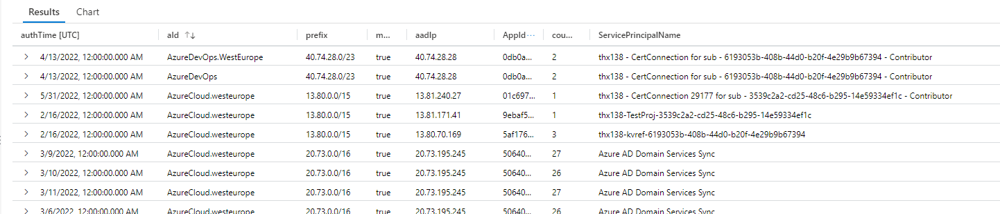

# Map Azure IP list to SPN sign-ins 


✅ Maps Azure IP range & service to SPN signins counted per day


## 
- Update download link from [Azure IP Ranges and Service Tags – Public Cloud](https://www.microsoft.com/en-us/download/details.aspx?id=56519) to url in ``externaldata()``
- Inspired by similar sentinel query for tenant sign-ins ``Azure Portal Signin from another Azure Tenant`` 
- The use of evaluate bag_unpack() was heavily inspired by work of [Matthew Zorich](https://twitter.com/reprise_99)

**Query**

```sql

let lookBack = 180d;
let spns = AADServicePrincipalSignInLogs 
| where TimeGenerated > ago(lookBack)
| project authTime=TimeGenerated, AppId, ServicePrincipalName, aadIp = IPAddress
| summarize count() by bin(authTime, 1d), AppId, aadIp, ServicePrincipalName
| summarize  make_list(pack_all(true));
let azIp =externaldata(changeNumber: string, cloud: string, values: dynamic)
["https://download.microsoft.com/download/7/1/D/71D86715-5596-4529-9B13-DA13A5DE5B63/ServiceTags_Public_20220613.json"]
with(format='multijson')
| mv-expand values
| project  aId =values.id, prefix =values.properties.addressPrefixes
| mv-expand prefix
| project aId, prefix;
azIp
| mv-apply spn= toscalar(spns) to typeof(dynamic) on 
    (
extend matc = ipv4_is_in_range(tostring(spn.aadIp),tostring(prefix)) 
    )
| where matc == true
| evaluate bag_unpack(spn)

```

**Result preview**

  

## Automatic updates for 

```js


const { axiosClient } = require('../src/axioshelpers')
const getToken = require('../src/token')

module.exports = async function (context, req) {

            var res = 'https://management.azure.com'

            var token = await getToken(res).catch((error) => {
                console.log(error)
                return context.done()
            })
            try {
                var data = await axiosClient({
                    url: `https://management.azure.com/subscriptions/6c052e74-e3b3-401b-8734-fafc98c8cf83/providers/Microsoft.Network/locations/westeurope/serviceTags?api-version=2021-08-01`,
                    method: "get",
                    headers: {
                        authorization: "Bearer " + token.access_token
                    }
                })

                return context.res = {
                    status: 200,
                    /* Defaults to 200 */
                    headers: {
                        "content-type": "application/json"
                    },
                    body: data?.data
                };

            } catch (error) {
                return context.res = {
                    status: 404,
                    /* Defaults to 200 */
                    body: {
                        err: error?.response?.data
                    }
                };

            }
}
```

**End**
